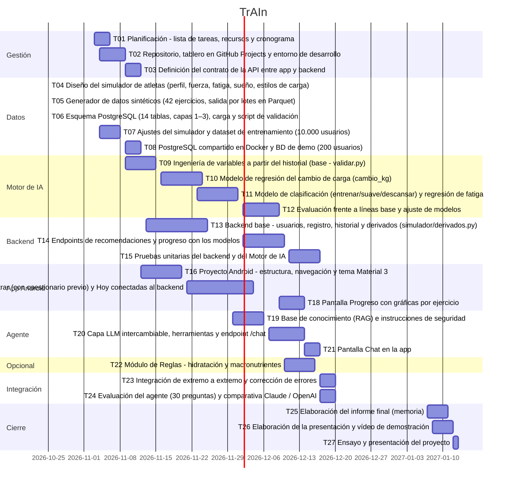

# Cronograma

Copia versionada del Gantt de `planificacion_TrAIn.pdf` (anexo B). Los datos de cada tarea están en [`scripts/tareas.tsv`](../scripts/tareas.tsv).

```mermaid
gantt
  title TrAIn
  dateFormat YYYY-MM-DD
  section Gestión
  T01 Planificación - lista de tareas, recursos y cronograma :t1, 2026-11-03, 2026-11-06
  T02 Repositorio, tablero en GitHub Projects y entorno de desarrollo :t2, 2026-11-04, 2026-11-09
  T03 Definición del contrato de la API entre app y backend :t3, 2026-11-09, 2026-11-12
  section Datos
  T04 Diseño del simulador de atletas (perfil, fuerza, fatiga, sueño, estilos de carga) :done, t4, 2026-10-25, 2026-10-25
  T05 Generador de datos sintéticos (42 ejercicios, salida por lotes en Parquet) :done, t5, 2026-10-25, 2026-10-25
  T06 Esquema PostgreSQL (14 tablas, capas 1–3), carga y script de validación :done, t6, 2026-10-25, 2026-10-25
  T07 Ajustes del simulador y dataset de entrenamiento (10.000 usuarios) :t7, 2026-11-04, 2026-11-08
  T08 PostgreSQL compartido en Docker y BD de demo (200 usuarios) :t8, 2026-11-09, 2026-11-12
  section Motor de IA
  T09 Ingeniería de variables a partir del historial (base - validar.py) :t9, 2026-11-09, 2026-11-15
  T10 Modelo de regresión del cambio de carga (cambio_kg) :t10, 2026-11-16, 2026-11-24
  T11 Modelo de clasificación (entrenar/suave/descansar) y regresión de fatiga :t11, 2026-11-23, 2026-12-01
  T12 Evaluación frente a líneas base y ajuste de modelos :t12, 2026-12-02, 2026-12-09
  section Backend
  T13 Backend base - usuarios, registro, historial y derivados (simulador/derivados.py) :t13, 2026-11-13, 2026-11-25
  T14 Endpoints de recomendaciones y progreso con los modelos :t14, 2026-12-02, 2026-12-10
  T15 Pruebas unitarias del backend y del Motor de IA :t15, 2026-12-11, 2026-12-17
  section App Android
  T16 Proyecto Android - estructura, navegación y tema Material 3 :t16, 2026-11-12, 2026-11-20
  T17 Pantallas Registrar (con cuestionario previo) y Hoy conectadas al backend :t17, 2026-11-21, 2026-12-04
  T18 Pantalla Progreso con gráficas por ejercicio :t18, 2026-12-09, 2026-12-14
  section Agente
  T19 Base de conocimiento (RAG) e instrucciones de seguridad :t19, 2026-11-30, 2026-12-06
  T20 Capa LLM intercambiable, herramientas y endpoint /chat :t20, 2026-12-07, 2026-12-14
  T21 Pantalla Chat en la app :t21, 2026-12-14, 2026-12-17
  section Opcional
  T22 Módulo de Reglas - hidratación y macronutrientes :t22, 2026-12-10, 2026-12-16
  section Integración
  T23 Integración de extremo a extremo y corrección de errores :t23, 2026-12-17, 2026-12-20
  T24 Evaluación del agente (30 preguntas) y comparativa Claude / OpenAI :t24, 2026-12-17, 2026-12-20
  section Cierre
  T25 Elaboración del informe final (memoria) :t25, 2027-01-07, 2027-01-11
  T26 Elaboración de la presentación y vídeo de demostración :t26, 2027-01-08, 2027-01-12
  T27 Ensayo y presentación del proyecto :t27, 2027-01-12, 2027-01-13
```
